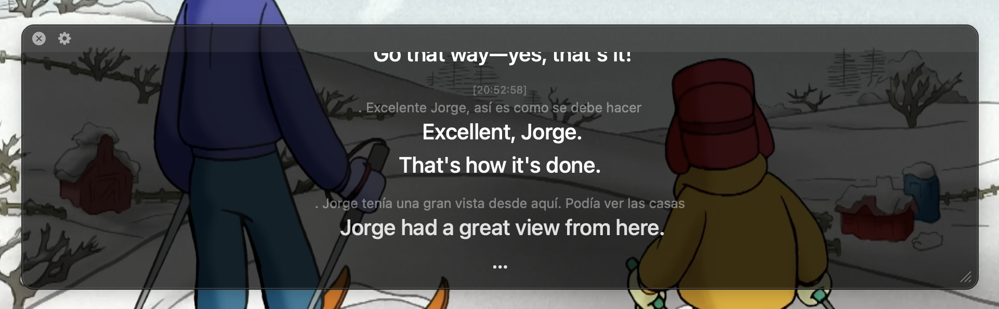

<p align="center">
  
</p>

# System Audio Subtitles

Live subtitles for whatever your Mac is playing, in a floating native window.
Captures system audio natively (no BlackHole, no ffmpeg) and streams it to
the OpenAI Realtime API — by default to `gpt-realtime-translate`, a model
purpose-built for live interpretation that emits translated text while the
sentence is still unfolding. (A transcribe-then-translate mode using
`gpt-realtime-whisper` + `gpt-4o-mini` is available too, and either mode can
show the original text alongside the translation.) Finished lines scroll into
a timestamped history above the live area.



> **Note:** transcription and translation run through the OpenAI API, so you
> need your own [OpenAI API key](https://platform.openai.com/account/api-keys)
> — usage is billed to your OpenAI account (see [Costs](#costs)).

## Install

Download the latest `SystemAudioSubtitles-x.y.z.dmg` from
[Releases](https://github.com/SixiS/system-audio-subtitles/releases), drag
**System Audio Subtitles** into Applications, and open it. The app is signed
and notarized — no Gatekeeper warnings. You'll need macOS 14.4 or newer and an
OpenAI API key. On first launch:

1. The window asks for your **OpenAI API key** (stored in your login keychain).
2. macOS asks to allow **System Audio Recording** — click Allow.

That's it — play something and subtitles appear. Settings live behind the
menu-bar captions icon and the gear in the window's top bar.

## Building from source

Requirements:

- macOS 14.4 or newer (uses Core Audio process taps)
- Xcode Command Line Tools (`xcode-select --install`) — provides `swiftc`
- Go 1.22+
- An OpenAI API key

## Build & run

```sh
make                      # builds bin/audiotap, bin/subtitle-window (Swift) and bin/sas (Go)
./bin/sas
```

On first run:

- The window asks for your **OpenAI API key** — paste one, or click
  *Use $OPENAI_API_KEY* if the environment variable is set. The key is stored
  in your **login keychain** (item "sas — OpenAI API key") and reused on later
  runs. Change it any time from the menu-bar item (see below). A key stored in
  the config file by older versions is migrated into the keychain
  automatically on the next run.
- macOS asks to allow **audiotap** to record system audio — click Allow. The
  grant is remembered, but because the helper is ad-hoc signed, **rebuilding it
  re-triggers the prompt** (its code hash changes). If a prompt never appears,
  check System Settings → Privacy & Security → Screen & System Audio Recording.

While running, a **captions icon in the menu bar** (and a gear in the window's
top bar) has the settings:

- *Preferences…* — capture device, target/source language, show-original,
  transcription-only, realtime translation, latency, sentence gap, max
  sentences per segment, and Dock icon. Saved
  changes apply immediately (session-level settings restart the live session)
  and persist in the config file. The capture device defaults to the system
  default output; pick a specific one (headphones, an interface) if capture
  ends up on the wrong device.
- *Edit API Key…* — applies immediately; a broken key shows a red error in the
  window until it's fixed.
- *Clear API Key & Quit* — deletes the key from the keychain (preferences
  survive) and shuts everything down.

The subtitle window floats above other apps; drag it to move, drag the corner
grip to resize, scroll back through the history whenever you like. Subtitles
form one continuous column: the in-progress text sits at the bottom and
pushes earlier lines up as it grows, and when a sentence is finalized it
stays exactly where it is — the next live line just starts underneath. The
window grows with the first few lines, then keeps a stable size.
Closing the window shuts the whole pipeline down. Finalized lines are also
echoed to the terminal as a plain transcript.

## Usage

```sh
./bin/sas [flags]

--target-lang en      language to translate into (default: en)
--source-lang ""      optional source-language hint (ISO 639-1); auto-detect if empty
--capture-device ""   output device UID to capture from (default: the system
                      default output device); list UIDs with --list-devices
--list-devices        print output devices as "uid<TAB>name" lines and exit
--show-original       also show the untranslated text above each subtitle
                      (default: off; in realtime-translate mode this adds
                      the transcription add-on to the bill — see Costs)
--no-translate        transcription only
--realtime-translate  translate speech directly with one purpose-built
                      interpreter model (gpt-realtime-translate) instead of
                      transcribing and then translating. Lower latency and
                      built for interpretation, at ~2x the cost (see Costs);
                      13 target languages; the source language is always
                      auto-detected, so --source-lang and --stream-delay
                      don't apply (default: on; disable with
                      --realtime-translate=false)
--stream-delay low    realtime latency/accuracy trade-off: minimal|low|medium|high|xhigh
--word-gap 1000       milliseconds without new transcribed words that ends a segment
--max-sentences 3     force-cut a live segment into history after this many
                      sentences, even without a pause (0 = no limit)
--dock-icon           show a Dock icon while running
                      (default: on; disable with --dock-icon=false)
```

All of these are also editable in the window's Preferences dialog, which
stores them in the config file. Stored preferences are the defaults on later
runs; an explicitly passed flag overrides the stored value for that run.

Examples:

```sh
./bin/sas --target-lang de                   # German subtitles
./bin/sas --target-lang de --show-original   # German subtitles + original text
./bin/sas --no-translate --source-lang ja    # Japanese transcript, no translation
```

Press Ctrl-C (or close the window) to stop; the exit summary reports the
minutes of audio streamed and the minutes of silence skipped.

## Costs

Rough numbers, at OpenAI's published pricing as of July 2026:

| What | Rate | Running for an hour |
|---|---|---|
| Transcription (`gpt-realtime-whisper`) | $0.017 per audio-minute | ~$1.02 |
| Translation (`gpt-4o-mini`) | ~$0.001–0.002 per minute of speech | ~$0.06–0.12 |
| `--realtime-translate` (`gpt-realtime-translate`) | $0.034 per audio-minute | ~$2.04 |
| Idle — nothing playing | keepalive frames only | ~$0.002 |

Realtime translation is the default, so an hour of continuous
foreign-language audio costs about **$2.04** — one purpose-built interpreter
model does everything, and that flat rate is the whole bill. Turning on
show-original adds the transcription row as an add-on to supply the source
text, about **$3.06** an hour. Switching realtime off
(`--realtime-translate=false`) uses the transcribe-then-translate rows
instead, about **$1.10** an hour, at the price of higher latency and less
interpretation-aware phrasing.

Either way, an hour left open in silence costs about **a fifth of a cent**
— the idle gate works the same in both modes. Only audio that
is actually streamed is billed: when the tap goes quiet for ~2 seconds the
pipeline stops sending frames (the window shows *idling…*) and resumes
instantly on the first audible frame. Translation calls only happen while
words are arriving. Quiet-but-audible audio (a faint music bed) still counts
as audio — the gate only saves money when the Mac is actually silent.

## How it works

```
┌──────────────┐   ┌────────────────────────┐   ┌────────────┐   ┌─────────────────┐
│ audiotap     │──▶│ Realtime API (ws)      │──▶│ translator │──▶│ subtitle-window │
│ (Swift, PCM) │   │ deltas, word-gap cuts  │   │ (OpenAI)   │   │ (Swift, AppKit) │
└──────────────┘   └────────────────────────┘   └────────────┘   └─────────────────┘
```

- **`helper/audiotap.swift`** — system-audio capture. Creates a global Core
  Audio process tap (macOS 14.4+), wraps it in a private aggregate device,
  converts to 24 kHz mono s16le, and writes raw PCM to stdout.
- **`helper/subtitlewindow.swift`** — the floating overlay. Reads JSON lines on
  stdin: `append` messages freeze text into the scrollable timestamped
  history, `live` messages rewrite the in-progress tail of the same column.
- **The Go pipeline** (`bin/sas`) spawns both helpers and connects them:
  - *realtime client* (`realtime.go`) — streams PCM to the Realtime API
    (`gpt-realtime-whisper`) over a WebSocket. The model streams source-language
    deltas continuously; a segment is *committed* once it has words but no new
    delta has arrived for `--word-gap`. Cutting on transcription activity
    rather than acoustic silence means background music can't hold a segment
    open — only speech does — and wordless audio never commits at all. Commits
    arrive in strict audio order and define subtitle ordering (delta arrival
    order across segments does not).
  - with `--realtime-translate` it connects to the translation endpoint
    instead: `gpt-realtime-translate` — a model trained on professional
    interpreter audio — streams translated text directly, and the translation
    manager below is bypassed entirely. When show-original is on, the source
    transcript is requested as a separately billed transcription add-on;
    otherwise it is left out and the flat translation rate is the whole
    bill. The stream has no segment structure, so subtitles are
    cut client-side: when the translation closes a sentence and then goes
    quiet for `--word-gap` (plus the same `--max-sentences` force-cut).
  - *translation manager* (`pipeline.go`) — races provisional fragment
    translations (every couple of new words, via `gpt-4o-mini`) against the
    authoritative full-sentence translation requested when the segment
    completes, guarded by per-segment versioning so a stale result can never
    overwrite a newer one. A rolling window of recent lines gives the
    translator pronoun/tense continuity.
  - *display* (`display.go`) — drives the window over its stdin protocol and
    echoes finalized lines to the terminal.

### The permission dance

macOS attributes a CLI tool's permission request to the terminal app that
launched it, and refuses to even show the System Audio Recording prompt when
that app lacks `NSAudioCaptureUsageDescription` in its Info.plist (which
terminals don't have). To get its own prompt, audiotap re-execs itself with
*disclaimed responsibility* (`posix_spawn` + `POSIX_SPAWN_SETEXEC` +
`responsibility_spawnattrs_setdisclaim`), becoming its own TCC subject with its
embedded Info.plist honored. If Apple ever removes that private API, the
fallback is granting the permission to your terminal manually — or swapping
the capture helper for a ScreenCaptureKit backend (`SCStream` with
`capturesAudio`), which honors the same PCM-on-stdout contract.

## Development

Dev modes that don't need live audio:

```sh
./bin/sas --record clip.wav --seconds 10   # capture a test WAV; reports peak/RMS
./bin/sas --input clip.wav                 # run the full pipeline on a file
```

The helpers are independently testable too: `bin/audiotap > out.pcm` while
audio plays, then inspect/convert the raw PCM (24 kHz mono s16le); and
`echo '{"type":"append","translation":"hello","time":"12:00:00"}' | bin/subtitle-window`
drives the window by hand.

Layout:

```
helper/audiotap.swift        system-audio capture (Swift, Core Audio process tap)
helper/subtitlewindow.swift  floating subtitle overlay (Swift, AppKit)
main.go                      flags and wiring
config.go                    stored preferences (~/Library/Application Support/sas)
keychain.go                  API key storage in the login keychain (via /usr/bin/security)
capture.go                   helper spawn / WAV input / --record mode
realtime.go                  Realtime API WebSocket client + segmentation
pipeline.go                  orchestrator: progressive-translation event loop
translate.go                 translation REST client (gpt-4o-mini, retries)
display.go                   subtitle-window driver
wav.go                       WAV encode/decode helpers
assets/                      app icon (PNG + .icns) and the script that draws it
packaging/                   app-bundle Info.plist and entitlements
scripts/release.sh           builds the universal .app, signs, notarizes, makes the DMG
RELEASING.md                 how releases are cut (Apple Developer setup, make release)
```

`make app` assembles an ad-hoc-signed `System Audio Subtitles.app` in `dist/`
for local testing; `make release VERSION=vX.Y.Z` produces the signed,
notarized DMG (see [RELEASING.md](RELEASING.md)).

## Contributing

Issues and PRs welcome. A few ground rules:

- Keep Go dependencies minimal (currently just `coder/websocket`); prefer stdlib.
- `gofmt` and `go vet ./...` must pass; test with the dev modes above before
  opening a PR (a short `--input` WAV in a foreign language is the quickest
  end-to-end check).
- The capture helper's contract is exactly "24 kHz mono s16le PCM on stdout,
  diagnostics on stderr" — alternative capture backends (e.g. ScreenCaptureKit)
  are welcome as long as they honor it.
- Roadmap ideas welcome — currently on the list: helper auto-restart, SRT
  export, realtime-session reconnect, and following default-output-device
  changes mid-run.

## License

[MIT](LICENSE)
